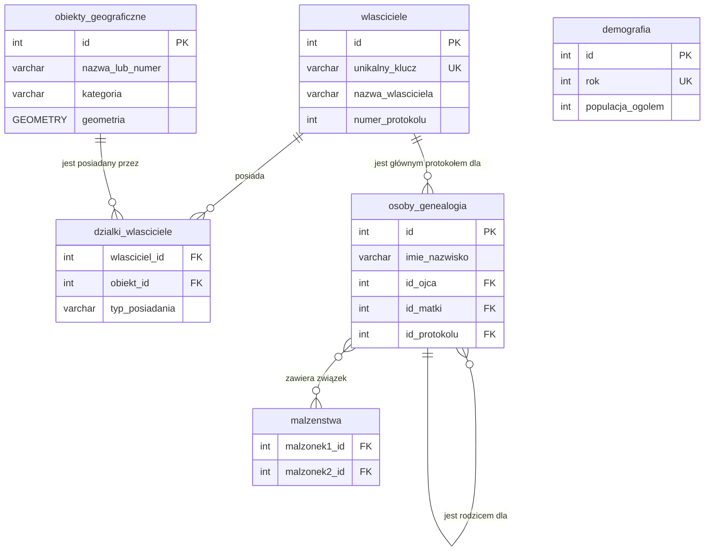

# Interaktywna Mapa Katastralna Gminy Czarna z XIX wieku

---

### Praca Inżynierska

**Autor:**
> Maksymilian Augustyn

**Opiekun pracy:**
> dr inż. Adam Pieprzycki

**Uczelnia:**
> Akademia Tarnowska

---

# Wstęp

Niniejsza praca inżynierska opisuje kompleksowy proces projektowania, implementacji oraz wdrożenia zintegrowanego systemu informatycznego służącego do wizualizacji i analizy historycznych danych katastralnych. **Problem badawczy**, który stanowił punkt wyjścia dla projektu, dotyczy wyzwań związanych z digitalizacją, ustrukturyzowaniem i udostępnianiem danych archiwalnych. Materiały te, w swojej pierwotnej, papierowej formie, są nie tylko trudno dostępne dla szerokiego grona odbiorców, ale również podatne na nieodwracalną degradację fizyczną.

Celem pracy jest zaprezentowanie kompletnego rozwiązania, które transformuje statyczne, analogowe zapisy w dynamiczną, interaktywną bazę wiedzy, dostępną poprzez nowoczesną aplikację webową.

---

# Rozdział 1. Analiza i Założenia Projektowe

## 1.1. Cel i Zakres Pracy

**Celem głównym** pracy było stworzenie w pełni funkcjonalnej, interaktywnej mapy katastralnej Gminy Czarna, bazującej na danych z 1882 roku, w formie aplikacji webowej full-stack. System ten ma za zadanie nie tylko cyfrowo zabezpieczyć cenne dane historyczne, ale również "ożywić" je, udostępniając w przystępnej i dynamicznej formie szerokiemu gronu odbiorców – od historyków i genealogów, po lokalnych pasjonatów i potomków dawnych mieszkańców.

Do realizacji celu głównego zdefiniowano następujące **cele szczegółowe**, które wyznaczyły zakres prac:
*   **Digitalizacja i Integracja:** Przetworzenie danych z analogowych map i protokołów katastralnych do ustrukturyzowanej postaci cyfrowej i zintegrowanie ich w jednej, spójnej bazie danych.
*   **Projekt i Implementacja Bazy Danych:** Stworzenie wydajnego i skalowalnego schematu relacyjnej bazy danych z wykorzystaniem rozszerzenia przestrzennego PostGIS do obsługi geometrii obiektów.
*   **Budowa Ekosystemu Narzędziowego:** Opracowanie dedykowanych, graficznych aplikacji deweloperskich (GUI) w celu zapewnienia integralności i poprawności danych już na etapie ich wprowadzania.
*   **Implementacja Warstwy Backendowej:** Zbudowanie serwera API w technologii Python/Flask, który zarządza logiką biznesową i pełni rolę pośrednika między bazą danych a interfejsem użytkownika.
*   **Implementacja Warstwy Frontendowej:** Stworzenie interaktywnego interfejsu użytkownika z wykorzystaniem technologii HTML, CSS, JavaScript oraz biblioteki Leaflet.js do wizualizacji danych kartograficznych.
*   **Rozwój Modułów Analitycznych:** Wzbogacenie systemu o funkcjonalności wykraczające poza prostą wizualizację, takie jak generowanie statystyk, porównywanie protokołów oraz eksploracja powiązań genealogicznych.

Projekt stanowi również odpowiedź na osobiste zainteresowanie historią regionu oraz chęć wykorzystania nowoczesnych technologii do ochrony i popularyzacji lokalnego dziedzictwa kulturowego.

## 1.2. Założenia i Ograniczenia Projektu

Projekt opierał się na następujących kluczowych założeniach:
*   **Wierność Źródłom:** System musi jak najwierniej odwzorowywać dane zawarte w oryginalnych dokumentach, z uwzględnieniem historycznej terminologii i formy zapisu.
*   **Otwartość Technologiczna:** Rozwiązanie bazuje wyłącznie na otwartych i darmowych technologiach (Open Source), co minimalizuje koszty wdrożenia i zapewnia możliwość dalszego, nieograniczonego rozwoju.
*   **Modularność Architektury:** Architektura systemu powinna być rozszerzalna, aby w przyszłości umożliwić łatwe dodawanie nowych funkcjonalności (np. obsługa map z innych okresów).

Głównym **ograniczeniem projektu** jest jakość materiałów źródłowych. Nieczytelność niektórych fragmentów mapy oraz ręcznie pisanych protokołów uniemożliwiła pełną digitalizację 100% obiektów i danych. Aplikacja prezentuje tak kompletny zbiór informacji, jak było to możliwe do odtworzenia na podstawie dostępnych archiwaliów.

## 1.3. Słownik Kluczowych Pojęć

*   **Protokół Katastralny:** Oficjalny dokument z XIX wieku, stanowiący szczegółowy zapis stanu posiadania dla jednego właściciela (lub grupy współwłaścicieli).
*   **Własność Rzeczywista:** Zbiór działek, które na podstawie analizy protokołu i mapy zostały zweryfikowane jako faktyczna własność danej osoby w badanym okresie.
*   **Własność wg Protokołu:** Zbiór działek przypisanych do osoby w oryginalnym dokumencie, który mógł zawierać błędy pisarskie lub nieaktualne informacje. Rozróżnienie to pozwala na analizę rozbieżności w danych historycznych.
*   **Obiekty Specjalne:** Kategoria obiektów punktowych o szczególnym znaczeniu dla społeczności, np. dworzec kolejowy, młyn, kościół.
*   **Infrastruktura:** Kategoria obiektów liniowych, które nie stanowiły własności prywatnej, takich jak drogi publiczne i rzeki.

---

# Rozdział 2. Analiza Materiałów Źródłowych

Podstawą merytoryczną projektu są zdigitalizowane i zinterpretowane materiały archiwalne pochodzące z dwóch niezależnych źródeł. Precyzyjne zrozumienie charakteru tych dokumentów było kluczowe dla właściwego zaprojektowania modelu danych oraz funkcjonalności całego systemu.

## 2.1. Dane Katastralne: Protokoły i Mapa

Głównym źródłem danych o strukturze własnościowej są **protokoły dochodzeń miejscowych celem założenia księgi hipotecznej dla gminy katastralnej Czarna**, datowane na 1882 rok. Oryginalne dokumenty przechowywane są w zasobach **Archiwum Państwowego w Tarnowie**.

*   **Charakterystyka Źródła:** Protokoły te stanowią szczegółowy zapis stanu posiadania dla każdego właściciela w gminie. Zawierają one dane osobowe, numery posiadanych parceli (z podziałem na budowlane i gruntowe), a także niezwykle cenne opisy tekstowe dotyczące historii nabycia własności, relacji rodzinnych, transakcji oraz służebności.
*   **Proces Digitalizacji:** Każdy protokół został zeskanowany, a jego treść została wiernie przepisana do postaci cyfrowej. Te transkrypcje stały się podstawą dla danych w tabeli `wlasciciele` oraz dla autorskich sekcji analitycznych (np. `powiazania_i_transakcje`).

Dane przestrzenne pochodzą z oryginalnej, XIX-wiecznej mapy katastralnej gminy Czarna, która stanowiła wizualne uzupełnienie protokołów. Geometria działek, dróg, rzek i budynków została ręcznie odwzorowana w **Edytorze Działek**.

## 2.2. Dane Genealogiczne: Księgi Metrykalne

Źródłem danych dla modułu genealogicznego są **księgi metrykalne (akty urodzeń, małżeństw i zgonów)** dla parafii na terenie gminy Czarna z XIX wieku. Dokumenty te przechowywane są w **Archiwum Diecezjalnym w Tarnowie**.

*   **Charakterystyka Źródła:** Księgi metrykalne pozwoliły na odtworzenie powiązań rodzinnych między mieszkańcami gminy. Zawierają one informacje o datach urodzenia i śmierci, imionach rodziców oraz danych małżonków, co umożliwiło zbudowanie wielopokoleniowych drzew genealogicznych.
*   **Proces Integracji:** Dane z ksiąg zostały starannie przeanalizowane i wprowadzone do systemu za pomocą **Edytora Genealogii**. Kluczowym wyzwaniem była identyfikacja i połączenie osób z ksiąg metrykalnych z właścicielami z protokołów katastralnych, co pozwoliło na stworzenie spójnej, zintegrowanej bazy danych społeczno-gospodarczych.

---

# Rozdział 3. Architektura Systemu i Technologie

## 3.1. Koncepcja Architektoniczna

System został zaprojektowany w oparciu o sprawdzoną, **trójwarstwową architekturę full-stack**, która zapewnia wyraźny podział odpowiedzialności pomiędzy warstwą prezentacji, logiki biznesowej i składowania danych. Taki model gwarantuje wysoką elastyczność, skalowalność oraz łatwość w utrzymaniu i dalszym rozwoju systemu.

| Warstwa | Technologia | Rola w Systemie |
| :--- | :--- | :--- |
| **Frontend** | HTML, CSS, JavaScript (Leaflet.js) | Odpowiada za interfejs użytkownika, wizualizację interaktywnej mapy, paneli informacyjnych oraz interakcję z użytkownikiem. |
| **Backend (API)** | Python (Flask) | Stanowi serce aplikacji. Zarządza logiką biznesową, przetwarza żądania od klienta, komunikuje się z bazą danych i udostępnia dane poprzez REST API. |
| **Baza Danych**| PostgreSQL + PostGIS | Przechowuje w sposób ustrukturyzowany wszystkie dane opisowe (protokoły, genealogia) oraz, dzięki rozszerzeniu PostGIS, dane przestrzenne (geometria działek, dróg, budynków). |

**Diagram Architektury Systemu:**

**[WSTAW TUTAJ DIAGRAM/SCHEMAT ARCHITEKTURY - jeśli go masz, jeśli nie, tabela powyżej jest wystarczająca]**

## 3.2. Uzasadnienie Wyborów Technologicznych

Dobór technologii był podyktowany chęcią stworzenia wydajnego, niezawodnego i otwartego ekosystemu.

*   **Backend (Python + Flask):** Wybór lekkiego frameworka Flask był podyktowany jego minimalizmem i elastycznością. Idealnie nadaje się on do tworzenia REST API, a jego prostota pozwoliła na szybkie prototypowanie i pełną kontrolę nad każdym komponentem aplikacji bez narzucania zbędnej, nadmiarowej struktury.

*   **Frontend (Czysty JavaScript + Leaflet.js):** Rezygnacja z ciężkich frameworków (jak React czy Angular) na rzecz czystego JavaScriptu była świadomą decyzją projektową, mającą na celu skupienie się na fundamentalnych technologiach webowych i minimalizację zależności. Biblioteka **Leaflet.js** została wybrana jako lekki, a jednocześnie potężny standard do tworzenia interaktywnych map, oferujący bogaty zestaw funkcji przy zachowaniu bardzo wysokiej wydajności.

*   **Wizualizacja Danych (D3.js):** Do realizacji zaawansowanej wizualizacji hierarchicznej, jaką jest drzewo genealogiczne, wykorzystano bibliotekę **D3.js (Data-Driven Documents)**. Jest to potężne narzędzie pozwalające na pełną kontrolę nad generowaniem dynamicznej grafiki SVG na podstawie danych. W przeciwieństwie do gotowych bibliotek do wykresów, D3.js dało swobodę implementacji autorskiego algorytmu pozycjonowania węzłów, który poprawnie modeluje złożone relacje rodzinne, co było kluczowym wymaganiem projektu.

*   **Baza Danych (PostgreSQL + PostGIS):** PostgreSQL to potężny, otwarty system zarządzania relacyjnymi bazami danych, znany ze swojej niezawodności i zgodności ze standardami SQL. Kluczowe dla projektu było jednak rozszerzenie **PostGIS**, które dodaje obsługę typów i funkcji geograficznych, stając się de facto standardem branżowym do przechowywania i analizy danych przestrzennych. Umożliwia ono wykonywanie złożonych zapytań geoprzestrzennych bezpośrednio w bazie danych, co jest fundamentalne dla funkcjonalności mapy.

---

# Rozdział 4: Projekt Bazy Danych

Sercem systemu jest relacyjna baza danych PostgreSQL, rozszerzona o PostGIS, która pełni rolę centralnego repozytorium dla wszystkich danych projektu. Model danych został zaprojektowany z naciskiem na **integralność referencyjną**, **normalizację** (w celu unikania redundancji danych) oraz **wydajność** zapytań atrybutowych i przestrzennych. Struktura bazy została oparta na modelu encja-związek (ERD), który logicznie odwzorowuje powiązania między właścicielami, obiektami geograficznymi i danymi genealogicznymi.

## 4.1. Diagram Związków Encji (ERD)

Poniższy diagram przedstawia kluczowe tabele w bazie danych oraz relacje (klucze obce) między nimi. Wizualizuje on, w jaki sposób dane o właścicielach, obiektach, demografii i genealogii są ze sobą połączone.


*Diagram 1: Uproszczony schemat relacji w bazie danych.*

## 4.2. Szczegółowy Opis Kluczowych Tabel

Schemat bazy danych składa się z następujących tabel:

#### `wlasciciele`
Przechowuje wszystkie dane opisowe pochodzące bezpośrednio z protokołów katastralnych. Każdy rekord odpowiada jednemu protokołowi.
*   `id (SERIAL, PK)`: Unikalny, auto-inkrementowany identyfikator.
*   `unikalny_klucz (VARCHAR, UK)`: Czytelny dla człowieka, unikalny identyfikator (np. "Jan_Kowalski_1"), używany w URL-ach i do łączenia z danymi ze skanów.
*   `nazwa_wlasciciela (VARCHAR)`: Imię i nazwisko właściciela.
*   `numer_protokolu (INTEGER)`: Numer porządkowy z oryginalnego dokumentu.
*   `...` (pozostałe pola tekstowe): Kolumny takie jak `genealogia`, `historia_wlasnosci`, `uwagi` przechowują transkrypcje z oryginalnych protokołów.

#### `obiekty_geograficzne`
Uniwersalna tabela na wszystkie obiekty przestrzenne z mapy.
*   `id (SERIAL, PK)`: Unikalny identyfikator obiektu.
*   `nazwa_lub_numer (VARCHAR)`: Numer parceli lub nazwa obiektu (np. "Rzeka Czarna").
*   `kategoria (VARCHAR)`: Typ obiektu, np. `rolna`, `budowlana`, `droga`, `budynek`.
*   `geometria (GEOMETRY)`: Kluczowa kolumna typu PostGIS przechowująca geometrię obiektu (punkt, linia lub poligon) w układzie współrzędnych WGS 84 (EPSG:4326).

#### `dzialki_wlasciciele`
Tabela łącząca, realizująca relację wiele-do-wielu między właścicielami a obiektami.
*   `wlasciciel_id (INTEGER, FK)`: Klucz obcy wskazujący na tabelę `wlasciciele`.
*   `obiekt_id (INTEGER, FK)`: Klucz obcy wskazujący na tabelę `obiekty_geograficzne`.
*   `typ_posiadania (VARCHAR)`: Rozróżnienie, czy jest to własność "rzeczywista", czy "z protokołu", co pozwala na analizę rozbieżności w danych.

#### `demografia`
Przechowuje historyczne dane demograficzne dla gminy.
*   `rok (INTEGER, UK)`: Kluczowy rok, dla którego wpis dotyczy.
*   `populacja_ogolem`, `katolicy`, `zydzi` (INTEGER): Dane liczbowe.

#### `osoby_genealogia`
Centralna tabela modułu genealogicznego, przechowująca informacje o poszczególnych osobach.
*   `id (SERIAL, PK)`: Wewnętrzny identyfikator bazodanowy.
*   `json_id (INTEGER, UK)`: Oryginalne ID z pliku `genealogia.json`, zapewniające spójność przy imporcie.
*   `id_ojca (INTEGER, FK)`: Klucz obcy wskazujący na rekord ojca w tej samej tabeli (relacja do samego siebie).
*   `id_matki (INTEGER, FK)`: Klucz obcy wskazujący na rekord matki w tej samej tabeli.
*   `id_protokolu (INTEGER, FK)`: Opcjonalny klucz obcy wskazujący, czy dana osoba jest główną postacią w którymś z protokołów w tabeli `wlasciciele`.

#### `malzenstwa`
Tabela łącząca dla relacji małżeńskich (wiele-do-wielu między osobami).
*   `malzonek1_id (INTEGER, FK)`: Klucz obcy do tabeli `osoby_genealogia`.
*   `malzonek2_id (INTEGER, FK)`: Klucz obcy do tabeli `osoby_genealogia`.

## 4.3. Integralność Danych

Integralność referencyjna danych jest zapewniona poprzez użycie kluczy obcych z regułą `ON DELETE CASCADE`. Gwarantuje to, że usunięcie rekordu nadrzędnego (np. właściciela) automatycznie powoduje usunięcie wszystkich powiązanych z nim rekordów podrzędnych (np. wpisów w tabeli `dzialki_wlasciciele`), co zapobiega powstawaniu osieroconych danych i utrzymuje spójność bazy.

---

# Rozdział 5: Implementacja Ekosystemu Narzędziowego

Jednym z kluczowych założeń projektu było stworzenie nie tylko aplikacji końcowej, ale kompletnego, samowystarczalnego ekosystemu do zarządzania cyklem życia danych historycznych. W tym celu zaimplementowano zestaw dedykowanych narzędzi, które automatyzują, upraszczają i zabezpieczają procesy deweloperskie i administracyjne.

### 5.1. Launcher (`launcher/launcher_app.py`) - Zintegrowane Centrum Dowodzenia

Launcher to centralna aplikacja desktopowa (GUI) napisana w Pythonie z użyciem biblioteki Tkinter. Pełni rolę zintegrowanego centrum dowodzenia całym ekosystemem, eliminując potrzebę pracy z wieloma terminalami i ręcznego wpisywania komend. Został zaprojektowany w celu maksymalnego uproszczenia codziennej pracy z projektem.

**Kluczowe funkcjonalności Launchera:**

*   **Zarządzanie Serwerem:** Umożliwia uruchomienie serwera backendowego w dwóch trybach:
    *   **Lokalnym:** Serwer dostępny tylko na lokalnej maszynie (`127.0.0.1`).
    *   **Sieciowym:** Serwer dostępny dla innych urządzeń w sieci lokalnej (nasłuchuje na `0.0.0.0`), z automatyczną konfiguracją reguł firewalla w systemie Windows.
*   **Automatyzacja Migracji:** Pozwala na bezpieczne przeprowadzenie procesu migracji danych z plików JSON do bazy PostgreSQL jednym kliknięciem.
*   **Zintegrowane Narzędzia Administracyjne:**
    *   **Menedżer Kopii Zapasowych:** Umożliwia tworzenie, przywracanie i zarządzanie kompletnymi archiwami `.zip` zawierającymi zarówno dane, jak i skany protokołów.
    *   **Konfiguracja Bazy Danych:** Oferuje wbudowany edytor pliku konfiguracyjnego `.env`, co pozwala na zmianę parametrów połączenia z bazą bez opuszczania aplikacji.
    *   **Ustawienia Administratora:** Dedykowany panel do zarządzania bezpieczeństwem panelu admina, w tym włączanie/wyłączanie autoryzacji oraz bezpieczne ustawianie hasła (które jest automatycznie haszowane).
*   **Szybki Dostęp i Monitoring:**
    *   **Uruchamianie Narzędzi:** Zapewnia bezpośredni dostęp do wszystkich edytorów (właścicieli, działek, genealogii) oraz do uruchamiania zautomatyzowanych testów jednostkowych (`pytest`).
    *   **Bezpośrednie Linki:** Oferuje przyciski otwierające kluczowe widoki aplikacji (strona główna, mapa, panel admina) bezpośrednio w przeglądarce.
    *   **Zarządzanie Procesami:** Wyświetla listę wszystkich aktywnych procesów potomnych (serwer, edytory) wraz z ich identyfikatorami (PID) i pozwala na ich awaryjne zatrzymanie.
    *   **Wielozakładkowa Konsola:** Każdy uruchomiony proces otrzymuje własną zakładkę z konsolą, w której na żywo wyświetlane są jego logi, co ułatwia diagnostykę i monitoring.

**[WSTAW TUTAJ ZRZUT EKRANU: Główne okno Launchera z widoczną konsolą i kilkoma uruchomionymi procesami w zakładkach]**

### 5.2. Edytor Właścicieli (`tools/owner_editor.py`)

Edytor Właścicieli to samodzielna, w pełni funkcjonalna aplikacja desktopowa (GUI) napisana w Pythonie z użyciem biblioteki Tkinter. Została ona zaprojektowana jako dedykowane, "idiotoodporne" narzędzie dla historyków, badaczy i osób wprowadzających dane, aby w sposób ustrukturyzowany i bezpieczny zarządzać kluczowymi danymi tekstowymi projektu.

**Problem, który rozwiązuje:** Ręczna edycja złożonych plików JSON jest nie tylko niewygodna, ale przede wszystkim wysoce podatna na błędy (literówki, błędy składni), które mogłyby uniemożliwić późniejszą migrację danych do bazy. Edytor całkowicie eliminuje to ryzyko, udostępniając przyjazny, graficzny interfejs, który prowadzi użytkownika przez cały proces i dba o poprawność formatu danych.

**Kluczowe cechy i inteligentne funkcjonalności:**

*   **Nowoczesny i Estetyczny Interfejs:** Aplikacja została zaprojektowana z dbałością o doświadczenie użytkownika (UX). Posiada czytelny, responsywny układ, który automatycznie dostosowuje się do rozdzielczości ekranu. Użycie stylizowanych widżetów (ttk) i przemyślane rozmieszczenie elementów sprawiają, że praca z narzędziem jest intuicyjna i przyjemna.

*   **Zintegrowane Centrum Danych Tekstowych:** Edytor stanowi centralny punkt zarządzania nie tylko protokołami, ale również danymi demograficznymi.
    *   **Edytor Protokołów:** Główny moduł aplikacji, który pozwala na edycję wszystkich pól protokołu w wygodnym formularzu. Pola wielolinijkowe, takie jak "Historia własności" czy "Genealogia", posiadają przycisk **"Powiększ"**, otwierający dedykowane, duże okno edytora tekstu, co znacząco ułatwia pracę z obszernymi opisami.
    *   **Zintegrowany Edytor Demografii:** Narzędzie posiada wbudowany, dedykowany moduł do zarządzania danymi demograficznymi. Po kliknięciu przycisku "Demografia", otwiera się osobne okno z interfejsywną tabelą, która pozwala na **dodawanie, edycję i usuwanie wpisów demograficznych dla poszczególnych lat**. Wszystkie zmiany są zapisywane do osobnego pliku `demografia.json`.

*   **Zarządzanie Skanami:** Edytor jest w pełni zintegrowany z systemem plików. Sekcja "Zarządzanie Skanami" w formularzu edycji protokołu pozwala na:
    *   **Bezpośrednie dodawanie plików:** Użytkownik może wybrać z dysku jeden lub więcej plików `.jpg`, które są automatycznie kopiowane do odpowiedniego folderu i numerowane.
    *   **Zmianę kolejności stron:** Za pomocą przycisków "w górę" i "w dół" można intuicyjnie zmieniać kolejność stron protokołu, a edytor automatycznie przemianuje pliki, zachowując porządek.
    *   **Podgląd i usuwanie:** Podwójne kliknięcie na plik na liście otwiera go w domyślnej przeglądarce obrazów.

*   **Automatyzacja Zarządzania Folderami:** Narzędzie automatyzuje pracę z folderami na skany:
    *   Gdy tworzony jest nowy protokół, edytor **automatycznie tworzy w katalogu `assets/protokoly/` nowy folder** o nazwie odpowiadającej unikalnemu kluczowi.
    *   Gdy wpis właściciela jest usuwany, edytor wykrywa istnienie powiązanego folderu i **proponuje jego jednoczesne usunięcie**, co zapobiega pozostawianiu "osieroconych" danych.

*   **Wbudowany Menedżer Kopii Zapasowych:** Edytor posiada własny menedżer kopii, który pozwala na tworzenie i przywracanie kompletnych archiwów `.zip`. Każde archiwum zawiera pliki `.json` (właściciele, demografia) oraz **cały katalog ze wszystkimi skanami protokołów**.

*   **Inteligentne Podpowiedzi i Walidacja:**
    *   **Podpowiedzi kontekstowe:** W polu "Powiązania i transakcje" znajduje się ikona pomocy, która wyświetla tooltip z instrukcją formatowania linków.
    *   **Walidacja klucza:** System dba o poprawność i unikalność unikalnego klucza właściciela.

*   **Centralny Eksport Danych:** Wszystkie dane (właściciele i demografia) są eksportowane do czystych plików `.json` w folderze `backup/`, gotowych do użycia przez skrypt migracyjny.

**[WSTAW TUTAJ ZRZUT EKRANU: Okno edycji jednego właściciela w Edytorze Właścicieli, z widoczną sekcją zarządzania skanami]**

**[WSTAW TUTAJ ZRZUT EKRANU: Osobne okno Edytora Demografii, pokazujące tabelę z danymi]**

### 5.3. Edytor Działek (`tools/parcel_editor/parcel_editor_app.py`)

Edytor Działek to zaawansowane narzędzie zaprojektowane specjalnie do procesu digitalizacji obiektów przestrzennych z historycznej mapy katastralnej. Składa się z lekkiego serwera backendowego w Pythonie (Flask) oraz interaktywnego interfejsu frontendowego w przeglądarce, opartego na bibliotece **Leaflet.js** i jej rozszerzeniu do rysowania **Leaflet.PM (Geoman)**.

**Problem, który rozwiązuje:** Ręczne wprowadzanie współrzędnych geograficznych dla setek poligonów, linii i punktów jest nie tylko niepraktyczne i czasochłonne, ale również obarczone ogromnym ryzykiem błędu. Edytor Działek zastępuje ten proces w pełni wizualnym, intuicyjnym interfejsem "point-and-click", który pozwala na precyzyjne i szybkie odwzorowanie geometrii obiektów z oryginalnej mapy.

**Kluczowe cechy i funkcjonalności:**

*   **Wizualny Interfejs "Co widzisz, to dostajesz" (WYSIWYG):** Po uruchomieniu, narzędzie serwuje stronę internetową, na której historyczna mapa katastralna jest wyświetlana jako interaktywny podkład. Użytkownik może swobodnie powiększać i przesuwać mapę, aby dokładnie zidentyfikować granice działek, przebieg dróg czy lokalizację budynków.

*   **Zaawansowane Narzędzia Rysowania:**
    *   **Rysowanie Poligonów:** Dedykowane przyciski pozwalają na rysowanie obiektów powierzchniowych, takich jak działki rolne, budowlane, lasy czy pastwiska. Użytkownik klika kolejne wierzchołki, a narzędzie na bieżąco rysuje kształt.
    *   **Rysowanie Linii i Punktów:** Edytor obsługuje również rysowanie obiektów liniowych (drogi, rzeki) oraz punktowych (budynki, kapliczki), automatycznie dostosowując typ tworzonej geometrii do wybranej kategorii.
    *   **Inteligentne Narzędzia Pomocnicze:** Podczas rysowania poligonów dostępne są funkcje takie jak **"Cofnij Punkt"** i **"Zakończ"**, co daje pełną kontrolę nad procesem tworzenia geometrii.

*   **Kompleksowe Zarządzanie Obiektami:**
    *   **Panel Boczny:** Wszystkie narysowane obiekty są na bieżąco wyświetlane na liście w panelu bocznym, pogrupowane w logiczne zakładki (Działki, Inne Obiekty).
    *   **Interaktywna Lista:** Lista jest w pełni interaktywna – najechanie kursorem na obiekt na liście podświetla go na mapie, a kliknięcie centruje na nim widok.
    *   **Edycja Atrybutów:** Użytkownik może w każdej chwili zmienić numer/nazwę obiektu bezpośrednio z poziomu listy.
    *   **Edycja Geometrii:** Dedykowany przycisk "Edytuj geometrię" pozwala na modyfikację kształtu już istniejącego obiektu poprzez przeciąganie jego wierzchołków.

*   **Wbudowany Menedżer Kopii Zapasowych:** Podobnie jak Edytor Właścicieli, to narzędzie posiada własny system zarządzania backupami. Pozwala on na:
    *   **Tworzenie kopii zapasowych:** Jednym kliknięciem można stworzyć archiwum `parcels_data_backup_RRRRMMDD_GGMMSS.json`, zawierające aktualny stan wszystkich narysowanych obiektów.
    *   **Przywracanie z kopii:** Umożliwia wczytanie danych z dowolnego, wcześniejszego pliku kopii zapasowej, co chroni przed przypadkową utratą danych.
    *   **Zarządzanie plikami:** Pozwala na przeglądanie i usuwanie starych kopii zapasowych.

*   **Eksport w Standardzie GeoJSON:** Cała sesja rysowania jest na bieżąco zapisywana, a finalny wynik pracy jest przechowywany w pliku `backup/parcels_data.json`. Dane są zapisywane w formacie **GeoJSON**, który jest otwartym standardem w świecie systemów informacji geograficznej (GIS). Zapewnia to pełną interoperacyjność i gotowość danych do użycia przez skrypt migracyjny, który przetwarza je i importuje do bazy PostGIS.

**[WSTAW TUTAJ ZRZUT EKRANU: Główne okno Edytora Działek z widoczną mapą, narysowanymi obiektami, panelem bocznym i otwartym modalem menedżera kopii zapasowych]**

### 5.4. Edytor Genealogii (`tools/genealogy_editor/editor_app.py`)

Edytor Genealogii to wyspecjalizowane narzędzie webowe, zaprojektowane do zarządzania złożonymi powiązaniami rodzinnymi w ramach społeczności gminy Czarna. Podobnie jak Edytor Działek, opiera się on na architekturze z lekkim backendem w Pythonie (Flask) i dynamicznym interfejsem w przeglądarce.

**Problem, który rozwiązuje:** Ręczne modelowanie i utrzymywanie spójności wielopokoleniowych relacji rodzinnych w pliku tekstowym lub arkuszu kalkulacyjnym jest niezwykle trudne i podatne na błędy (np. niespójne ID, pętle w relacjach). Edytor Genealogii dostarcza ustrukturyzowany, tabelaryczny interfejs, który upraszcza tworzenie i walidację powiązań między osobami.

**Kluczowe cechy i funkcjonalności:**

*   **Interfejs Tabelaryczny z Inteligentnym Grupowaniem:** Wszystkie osoby w bazie genealogicznej są przedstawione w czytelnej, interaktywnej tabeli. W celu ułatwienia nawigacji, zaimplementowano mechanizm **automatycznego grupowania osób według rodów (nazwisk)**. Każda rodzina jest prezentowana w zwijanej sekcji, co pozwala na szybkie przeglądanie i analizę poszczególnych linii genealogicznych.

*   **Zarządzanie Osobami (CRUD):** Edytor zapewnia pełne możliwości zarządzania danymi osób:
    *   **Dodawanie:** Formularz "Dodaj Nową Osobę" pozwala na wprowadzenie wszystkich kluczowych danych, takich jak imię, nazwisko, płeć, lata życia czy powiązany protokół.
    *   **Edycja:** Każdy wpis w tabeli można edytować za pomocą dedykowanego formularza modalnego.
    *   **Usuwanie:** Bezpieczne usuwanie osób z bazy z prośbą o potwierdzenie.

*   **Intuicyjne Tworzenie Relacji:** Największą siłą edytora jest uproszczenie procesu tworzenia powiązaーん rodzinnych:
    *   **Autouzupełnianie:** Pola formularza służące do definiowania relacji ("Ojciec", "Matka", "Małżonek") zostały zintegrowane z **dynamiczną listą podpowiedzi (`<datalist>`)**. Podczas wpisywania imienia lub nazwiska, edytor na bieżąco sugeruje pasujące osoby z bazy, co eliminuje konieczność pamiętania i ręcznego wpisywania skomplikowanych identyfikatorów.
    *   **Walidacja i Symetryzacja:** Backend edytora dba o spójność danych. Przy zapisie weryfikuje, czy podane ID rodziców i małżonków istnieją w bazie. Dodatkowo, **automatycznie symetryzuje relacje małżeńskie** – przypisanie męża do żony automatycznie tworzy odwrotne powiązanie żony z mężem.

*   **Wbudowany Menedżer Kopii Zapasowych:** Narzędzie posiada własny system zarządzania kopiami zapasowymi, który pozwala na tworzenie, przywracanie i usuwanie archiwalnych wersji pliku `genealogia.json`. Zapewnia to bezpieczeństwo danych i możliwość powrotu do poprzednich stanów w razie pomyłki.

*   **Zintegrowana Wizualizacja Drzewa:** Edytor jest bezpośrednio połączony z modułem wizualizacji:
    *   Dla każdej rodziny (grupy w tabeli) dostępny jest przycisk **"Drzewo"**, który dynamicznie generuje i wyświetla w oknie modalnym interaktywne drzewo genealogiczne dla danego rodu, wykorzystując zaawansowany algorytm renderowania oparty na bibliotece D3.js.

*   **Eksport do Pliku JSON:** Całość danych genealogicznych jest zapisywana w ustrukturyzowanym pliku `backup/genealogia.json`, który następnie służy jako źródło dla głównego skryptu migracyjnego.

**[WSTAW TUTAJ ZRZUT EKRANU: Główne okno Edytora Genealogii, pokazujące tabelę z pogrupowanymi rodzinami i otwarty formularz edycji osoby z widocznym autouzupełnianiem]**

---

# Rozdział 6: Implementacja Backendu i Procesu Migracji

### 6.1.1 Serwer API (`backend/app.py`)

Backend aplikacji pełni rolę mózgu operacji. Został zaimplementowany w Pythonie przy użyciu mikroframeworka Flask. Jego główne zadania to:
*   **Udostępnianie REST API:** Serwuje dane z bazy PostgreSQL poprzez zdefiniowane endpointy (np. `/api/wlasciciele`, `/api/dzialki`). Dane są zwracane w formacie JSON, gotowym do użycia przez aplikację frontendową.
*   **Serwowanie Aplikacji Frontendowej:** Flask serwuje również wszystkie pliki statyczne (HTML, CSS, JS, obrazy), dzięki czemu cały projekt działa jako jedna, spójna aplikacja bez potrzeby konfiguracji zewnętrznych serwerów jak Apache czy Nginx.
*   **Logika Biznesowa:** Zawiera logikę do obsługi bardziej złożonych zapytań, np. generowanie danych do grafu powiązań czy statystyk.

#### Kluczowe Endpointy API

Poniżej opisano najważniejsze publiczne endpointy API, które dostarczają dane do aplikacji klienckiej:

*   **`GET /api/wlasciciele`**
    *   **Opis:** Zwraca listę wszystkich właścicieli wraz z podstawowymi informacjami o ich działkach.
    *   **Użycie:** Główna lista właścicieli na mapie interaktywnej.

*   **`GET /api/dzialki`**
    *   **Opis:** Zwraca wszystkie obiekty geograficzne z geometrią w standardowym formacie GeoJSON. Zapytanie jest realizowane bezpośrednio w bazie danych, co zapewnia wysoką wydajność.
    *   **Użycie:** Renderowanie wszystkich działek, dróg i budynków na mapie.

*   **`GET /api/wlasciciel/<unikalny_klucz>`**
    *   **Opis:** Zwraca szczegółowe dane dla jednego, konkretnego właściciela na podstawie jego unikalnego klucza.
    *   **Użycie:** Widok szczegółowego protokołu.

*   **`GET /api/stats`**
    *   **Opis:** Zwraca zagregowane dane statystyczne, w tym ogólne podsumowania, rankingi największych właścicieli oraz dane demograficzne.
    *   **Użycie:** Zasilanie w dane całej sekcji statystyk.

*   **`GET /api/graph-data`**
    *   **Opis:** Generuje dane potrzebne do wizualizacji grafu powiązań. Węzły to właściciele, a krawędzie są tworzone na podstawie linków zdefiniowanych w danych.
    *   **Użycie:** Renderowanie grafu powiązań.

*   **`GET /api/genealogia/<unikalny_klucz>`**
    *   **Opis:** Na podstawie klucza protokołu, algorytm przeszukuje bazę danych, aby znaleźć całą połączoną sieć rodzinną (a nie tylko bezpośrednich przodków/potomków) i zwraca ją w formacie gotowym do wizualizacji.
    *   **Użycie:** Generowanie dynamicznych drzew genealogicznych.

Panel administracyjny korzysta z osobnego zestawu endpointów pod ścieżką `/api/admin/...`, które implementują pełne operacje CRUD (Create, Read, Update, Delete) dla wszystkich kluczowych tabel.

#### 6.1.2. Mechanizmy Bezpieczeństwa

W celu zabezpieczenia panelu administracyjnego oraz ochrony integralności danych, zaimplementowano następujące mechanizmy:
*   **Konfigurowalna Autoryzacja:** Dostęp do panelu admina może być włączony lub wyłączony za pomocą zmiennej `ADMIN_AUTH_ENABLED` w pliku `.env`. Pozwala to na elastyczne dostosowanie poziomu bezpieczeństwa w zależności od środowiska (deweloperskie vs. produkcyjne).
*   **Haszowanie Haseł:** Hasła administratorów nie są przechowywane w formie czystego tekstu. Zamiast tego, używana jest biblioteka `werkzeug.security` do generowania i weryfikacji bezpiecznych haszy haseł (z użyciem soli), co uniemożliwia ich odczytanie nawet w przypadku wycieku danych z pliku konfiguracyjnego.
*   **Ochrona przed atakami Brute-Force:** System monitoruje próby logowania. Po przekroczeniu progu **pięciu nieudanych prób logowania** z tego samego adresu IP w ciągu 15 minut, adres ten jest automatycznie blokowany.
*   **Zarządzanie Zablokowanymi IP:** Zaimplementowano mechanizm przechowywania zablokowanych adresów IP w bazie danych. Launcher oferuje dedykowany interfejs "Menedżer Bezpieczeństwa", który pozwala administratorowi na:
    *   Przeglądanie logów z próbami logowania.
    *   Ręczne odblokowywanie adresów IP, w tym awaryjne odblokowanie `localhost` w przypadku przypadkowej samoblokady.

#### 6.1.3. Cykl Życia Danych i Proces Migracji

Dane w projekcie przechodzą przez precyzyjnie zdefiniowany, kontrolowany cykl życia, co zapewnia ich spójność i integralność.
1.  **Dane Źródłowe (`backup/*.json`):** Wszystkie dane wprowadzane są za pomocą dedykowanych edytorów, które zapisują je w postaci ustrukturyzowanych plików JSON. Pliki te stanowią "źródło prawdy" i podstawę do tworzenia kopii zapasowych.
2.  **Migracja (`backend/migrate_data.py`):** Skrypt migracyjny wczytuje pliki JSON, czyści docelowe tabele w bazie danych, a następnie importuje dane, transformując geometrię do formatu PostGIS (WKT). Proces ten jest idempotentny, co oznacza, że jego wielokrotne uruchomienie zawsze prowadzi do tego samego, spójnego stanu bazy.
3.  **Udostępnianie (API):** Działający serwer Flask udostępnia dane z bazy poprzez endpointy API.
4.  **Zarządzanie (Panel Admina):** Panel administracyjny pozwala na modyfikację danych bezpośrednio w bazie.
5.  **Backup (Eksport):** Funkcja eksportu w panelu admina odwraca proces migracji, generując pliki JSON z aktualnego stanu bazy danych, co zamyka cykl życia danych.

#### 6.1.4. Obsługa Błędów i Kody Statusu API

API zostało zaprojektowane z myślą o przewidywalnej obsłudze błędów. Klient front-endowy może polegać na standardowych kodach statusu HTTP w celu odpowiedniej reakcji.

| Kod Statusu | Znaczenie | Przykład Użycia | Przykładowy Response Body |
| :--- | :--- | :--- | :--- |
| **200 OK** | Sukces. Żądanie zostało pomyślnie przetworzone. | `GET /api/wlasciciele` | `{ "owners": [...] }` |
| **201 Created** | Sukces. Nowy zasób został pomyślnie utworzony. | `POST /api/admin/wlasciciele` | `{ "status": "success", "id": 123 }` |
| **400 Bad Request**| Błąd klienta. Żądanie zawiera nieprawidłowe lub brakujące dane. | `POST /api/admin/login` bez hasła | `{ "status": "error", "message": "Brakujące pole" }` |
| **401 Unauthorized**| Błąd uwierzytelnienia. Nieprawidłowy login lub hasło. | `POST /api/admin/login` z błędnym hasłem | `{ "status": "error", "message": "Nieprawidłowy login lub hasło." }` |
| **403 Forbidden** | Brak uprawnień. Użytkownik jest zidentyfikowany, ale nie ma dostępu. | Próba logowania z zablokowanego adresu IP | `{ "status": "error", "message": "Dostęp zablokowany." }` |
| **404 Not Found** | Nie znaleziono. Żądany zasób nie istnieje. | `GET /api/wlasciciel/nieistniejacy_klucz` | `{ "error": "Właściciel nie znaleziony" }` |
| **409 Conflict** | Konflikt. Próba utworzenia zasobu, który już istnieje. | `POST /api/admin/wlasciciele` z istniejącym kluczem | `{ "status": "error", "message": "ID już istnieje." }` |
| **500 Internal Server Error**| Błąd serwera. Wystąpił nieoczekiwany błąd po stronie backendu. | Błąd połączenia z bazą danych | `{ "status": "error", "message": "Wystąpił błąd serwera." }` |

### 6.2. Skrypt Migracyjny (`backend/migrate_data.py`)

Jest to kluczowy skrypt jednorazowego użytku, który zasila system w dane. Jego proces działania jest następujący:
1.  **Odczyt Danych Źródłowych:** Wczytuje dane z plików `owner_data_to_import.json` i `parcels_data.json`.
2.  **Czyszczenie Bazy Danych:** Usuwa wszystkie istniejące dane z tabel, aby zapewnić spójność i uniknąć duplikatów przy ponownej migracji.
3.  **Import Danych:** Wstawia rekordy do odpowiednich tabel (`wlasciciele`, `obiekty_geograficzne`, itd.), dbając o poprawne typy danych i relacje.
4.  **Transformacja Geometrii:** Konwertuje współrzędne geograficzne z formatu JSON do formatu WKT (Well-Known Text) wymaganego przez PostGIS, co umożliwia wykonywanie zapytań przestrzennych.

---

# Rozdział 7: Implementacja Aplikacji Frontendowej

Interfejs użytkownika został zbudowany z użyciem fundamentalnych technologii webowych: HTML5, CSS3 oraz czystego JavaScriptu (ES6+), co zapewniło wysoką wydajność i minimalną liczbę zależności.

### 7.1. Mapa Interaktywna (`mapa/`)

Głównym komponentem aplikacji jest interaktywna mapa, stanowiąca centralny punkt eksploracji danych katastralnych. Została ona zaprojektowana jako zaawansowany, wielofunkcyjny interfejs, który łączy w sobie wizualizację danych przestrzennych z bogatymi narzędziami analitycznymi i nawigacyjnymi.

#### 7.1.1. Podstawowa Architektura Mapy

Sercem modułu jest biblioteka **Leaflet.js**, która zarządza renderowaniem wszystkich warstw graficznych. Dane o obiektach geograficznych i właścicielach są dynamicznie pobierane z backendowego API, co zapewnia, że prezentowane informacje są zawsze aktualne. Mapa została skonfigurowana z precyzyjnymi ograniczeniami, uniemożliwiającymi użytkownikowi wyjście poza zdefiniowany obszar gminy (`maxBounds`) oraz nadmierne przybliżanie lub oddalanie widoku (`minZoom`, `maxZoom`), co gwarantuje płynność działania i kontekst geograficzny.

#### 7.1.2. Interfejs Użytkownika i Kluczowe Funkcjonalności

Interfejs został podzielony na trzy główne strefy: centralną mapę oraz dwa zwijane panele boczne, co pozwala na maksymalizację przestrzeni roboczej w zależności od potrzeb użytkownika.

**Panel Lewy - Właściciele:**
Panel ten jest dedykowany do przeglądania i analizy danych o właścicielach protokołów.
*   **Lista Właścicieli:** Domyślnie prezentuje listę wszystkich właścicieli, posortowaną według numeru protokołu.
*   **Interaktywność:**
    *   **Kliknięcie** na nazwisko właściciela natychmiast przenosi użytkownika do szczegółowego widoku jego protokołu.
    *   **Najechanie kursorem** na wpis na liście dynamicznie podświetla na mapie wszystkie działki należące do danego właściciela, co pozwala na szybką identyfikację jego posiadłości.
*   **Filtrowanie i Sortowanie:** Użytkownik ma do dyspozycji zaawansowane opcje sortowania listy: alfabetycznie (A-Z), według numeru protokołu (domyślnie) oraz według liczby posiadanych działek (od największej).
*   **Wyszukiwarka Kontekstowa:** Wbudowana wyszukiwarka pozwala na błyskawiczne filtrowanie listy zarówno po nazwisku, jak i po numerze protokołu.
*   **Rozróżnienie Własności:** Panel pozwala na wizualizację dwóch typów własności: **rzeczywistej** (potwierdzonej) oraz **według protokołu** (która może zawierać historyczne błędy). Dedykowane przyciski pozwalają na podświetlenie na mapie obu tych zbiorów działek, a specjalny przycisk przełączający umożliwia dynamiczną zmianę widoku.

**Panel Prawy - Działki i Obiekty:**
Ten panel służy do eksploracji obiektów geograficznych. Został podzielony na logiczne zakładki:
*   **Działki:** Grupuje działki rolne, budowlane, lasy i pastwiska. Posiada dodatkowe filtry pozwalające na włączanie i wyłączanie widoczności poszczególnych kategorii.
*   **Infrastruktura:** Prezentuje obiekty liniowe, takie jak drogi i rzeki.
*   **Specjalne:** Gromadzi obiekty punktowe o szczególnym znaczeniu, takie jak budynki mieszkalne, kapliczki oraz inne obiekty specjalne (np. dworzec kolejowy, młyn).
*   **Interaktywność:** Podobnie jak w panelu lewym, najechanie na obiekt na liście podświetla go na mapie, a kliknięcie centruje na nim widok.

**Centralny Widok Mapy:**
*   **Legenda Interaktywna:** W lewym dolnym rogu znajduje się zwijana legenda, która nie tylko objaśnia kolorystykę poszczególnych kategorii obiektów, ale również pozwala na dynamiczne włączanie i wyłączanie ich widoczności na mapie.
*   **Przełącznik Warstw:** W prawym górnym rogu zaimplementowano zaawansowany przełącznik warstw bazowych. Umożliwia on płynne przełączanie się między podkładem z XIX-wieczną mapą katastralną a współczesnymi widokami: **mapą drogową (OpenStreetMap)** oraz **ortofotomapą (satelitarną)**. Pozwala to na bezpośrednie porównanie historycznego układu gruntów z obecnym stanem terenu.
*   **Obsługa Współwłasności:** System inteligentnie obsługuje przypadki, gdy jedna działka ma wielu właścicieli. Kliknięcie na taki obiekt na mapie powoduje wyświetlenie okna dialogowego z listą wszystkich współwłaścicieli, umożliwiając użytkownikowi wybór protokołu, który chce przeanalizować.
*   **Informacje Kontekstowe:** W prawym górnym rogu na bieżąco wyświetlane są precyzyjne współrzędne geograficzne kursora. W prawym dolnym rogu znajduje się ukryta legenda, która pojawia się dynamicznie podczas podświetlania działek, aby objaśnić kolorystykę (np. przy porównywaniu stanu rzeczywistego i z protokołu).

**Dolny Pasek Narzędziowy:**
*   **Uniwersalna Wyszukiwarka:** Centralnie umieszczona wyszukiwarka pozwala na przeszukiwanie całej bazy danych – zarówno właścicieli, jak i obiektów – i prezentuje wyniki w formie dynamicznej listy.
*   **Liczniki Stanu:** Pasek na bieżąco informuje o liczbie **"Zaznaczonych"** obiektów (gdy jakaś grupa działek jest podświetlona) oraz **"Widocznych"** właścicieli (co jest szczególnie przydatne podczas filtrowania).
*   **Narzędzia Aplikacji:**
    *   **Tryb Pełnoekranowy:** Umożliwia przełączenie aplikacji w tryb pełnoekranowy.
    *   **Ustawienia:** Otwiera okno modalne, w którym użytkownik może zresetować widok do stanu początkowego lub przełączyć **motyw kolorystyczny na ciemny**. Wybrany motyw jest zapamiętywany i automatycznie stosowany we wszystkich modułach aplikacji (mapa, protokół, statystyki), zapewniając spójne doświadczenie wizualne.
    *   **Pomoc:** Wyświetla okno z informacjami o skrótach klawiszowych i wskazówkami dotyczącymi użytkowania.

**[WSTAW TUTAJ ZRZUT EKRANU: Główny widok mapy z otwartymi oboma panelami bocznymi i widocznym przełącznikiem warstw]**

### 7.2. Panel Administracyjny (`admin/`)

Panel Administracyjny to zaawansowana, w pełni funkcjonalna aplikacja webowa, zaprojektowana w architekturze **Single Page Application (SPA)**. Oznacza to, że cała logika interfejsu (przełączanie między widokami, edycja danych, wyświetlanie formularzy) odbywa się dynamicznie w jednym pliku HTML (`admin.html`), bez potrzeby przeładowywania strony. Takie podejście, które zastąpiło pierwotną koncepcję wielu oddzielnych stron (login, dashboard, edytory), zapewnia płynność działania i nowoczesne doświadczenie użytkownika.

Panel stanowi centralny punkt zarządzania danymi bezpośrednio w bazie PostgreSQL, oferując administratorowi intuicyjny i bezpieczny interfejs do wykonywania wszystkich kluczowych operacji.

**Kluczowe cechy i funkcjonalności Panelu Administracyjnego:**

*   **Zunifikowany Interfejs (SPA):** Wszystkie moduły zarządzania – od pulpitu, przez edytory właścicieli, obiektów, demografii, aż po genealogię – są dostępne w jednym, spójnym interfejsie bez konieczności nawigacji między różnymi stronami.
*   **Kompleksowy Interfejs CRUD:** Zapewnia pełen zestaw operacji (Tworzenie, Odczyt, Aktualizacja, Usuwanie) dla wszystkich kluczowych danych:
    *   **Zarządzanie Właścicielami:** Intuicyjny formularz pozwala na dodawanie i edycję protokołów. Kluczową funkcją jest **możliwość przypisywania działek z interaktywnej listy rozwijanej**, co eliminuje konieczność ręcznego wpisywania numerów z pamięci i minimalizuje ryzyko pomyłek.
    *   **Zarządzanie Demografią:** Przejrzysty interfejs tabelaryczny umożliwia łatwe dodawanie i edytowanie historycznych danych demograficznych dla poszczególnych lat.
*   **Zaawansowany Moduł Genealogiczny:**
    *   **Inteligentne Grupowanie:** Tabela z listą osób automatycznie grupuje je według rodów, co znacząco ułatwia nawigację po złożonych strukturach rodzinnych.
    *   **Wizualizacja Drzewa:** Zaimplementowano zaawansowany algorytm do renderowania interaktywnych drzew genealogicznych. Algorytm ten potrafi poprawnie wizualizować złożone relacje, np. **pokazując córkę zarówno w drzewie genealogicznym jej rodziców, jak i w drzewie rodziny jej męża**, co odzwierciedla realia historycznych powiązań.
*   **Narzędzia Administracyjne:**
    *   **Dynamiczny Backup Danych:** W każdej chwili administrator może kliknąć przycisk **"Ściągnij Backup"**, który uruchamia proces eksportu aktualnego stanu całej bazy danych do archiwum `.zip`. Funkcja ta jest nieoceniona przy migracji infrastruktury, tworzeniu kopii zapasowych lub gdy potrzebny jest lokalny zrzut danych bez konieczności ręcznego przepisywania.
    *   **Bezpieczeństwo:** Dostęp do panelu jest chroniony przez konfigurowalny system logowania, opisany szczegółowo w rozdziale dotyczącym bezpieczeństwa.
*   **Dbałość o Doświadczenie Użytkownika (UI/UX):**
    *   **Estetyczny Interfejs:** Panel został zaprojektowany z dbałością o detale wizualne, aby praca z danymi była nie tylko efektywna, ale i przyjemna.
    *   **Dynamiczne Elementy:** Interfejs zawiera "smaczki", takie jak dynamicznie aktualizowana data i zegar w czasie rzeczywistym, co dodaje mu profesjonalizmu.

**[WSTAW TUTAJ ZRZUT EKRANU: Dashboard Panelu Administracyjnego, pokazujący statystyki i menu boczne]**

**[WSTAW TUTAJ ZRZUT EKRANU: Widok edycji właściciela w panelu admina, z widoczną listą rozwijaną do wyboru działek]**

### 7.3. Moduły Analityczne (`wlasciciele/`, `graf/`)

Projekt został wzbogacony o dodatkowe moduły do analizy danych:
*   **Statystyki i Rankingi:** Strona prezentująca dynamicznie generowane rankingi największych właścicieli gruntów oraz statystyki dotyczące struktury własności.
*   **Porównywarka Protokołów:** Narzędzie pozwalające na wyświetlenie dwóch protokołów obok siebie w celu łatwego porównania.
*   **Graf Powiązań:** Wizualizacja relacji między protokołami, oparta na zdefiniowanych w danych linkach.

**[WSTAW TUTAJ ZRZUT EKRANU: Strona ze statystykami lub porównywarką]**

#### 7.3.1. Centrum Analityczne - Statystyki i Rankingi (`wlasciciele/stats.html`)

Strona statystyk została zaprojektowana jako nowoczesne **Centrum Analityczne (Dashboard)**, które prezentuje zagregowane dane w przystępnej i interaktywnej formie. Wykorzystuje bibliotekę **Chart.js** do dynamicznego generowania wykresów, co pozwala na wizualną reprezentację złożonych danych.

**Kluczowe komponenty Centrum Analitycznego:**

*   **Pulpit Główny (Hero Section):** Na górze strony znajdują się kluczowe wskaźniki (KPI), takie jak całkowita liczba zdigitalizowanych właścicieli i działek. Wartości te są animowane, co przyciąga uwagę użytkownika i podkreśla skalę zgromadzonych danych.

*   **Interaktywne Wykresy:**
    *   **Struktura Własności:** Wykres kołowy (doughnut chart) prezentuje procentowy udział poszczególnych kategorii działek (rolne, budowlane, lasy, etc.) w całej gminie.
    *   **Ranking Właścicieli:** Wykres słupkowy (bar chart) wizualizuje 10 największych posiadaczy gruntów, pozwalając na szybką identyfikację najbardziej wpływowych postaci w regionie.
    *   **Wykres Demograficzny:** Wykres liniowy (line chart) przedstawia zmiany w populacji gminy na przestrzeni lat, z podziałem na grupy wyznaniowe (katolicy, żydzi), co pozwala na analizę trendów demograficznych.

*   **Kalendarz Aktywności Spisowej:** Unikalna wizualizacja w formie "mapy ciepła" (heatmap), która pokazuje intensywność spisywania protokołów w poszczególnych dniach. Kolor komórki odpowiada liczbie protokołów utworzonych danego dnia, co pozwala na analizę rytmu pracy komisji katastralnej.

*   **Zaawansowane Rankingi z Filtrowaniem:**
    *   **Dynamiczna Lista:** Moduł prezentuje szczegółową, sortowalną listę wszystkich właścicieli, uszeregowaną według liczby posiadanych działek.
    *   **Filtrowanie Kontekstowe:** Użytkownik może dynamicznie filtrować rankingi na podstawie **typu własności** (rzeczywista vs. z protokołu) oraz **kategorii działek** (np. pokazując ranking tylko właścicieli lasów).
    *   **Integracja z Mapą:** Dedykowany przycisk **"Pokaż TOP 10 na mapie"** pozwala na natychmiastową wizualizację posiadłości 10 największych właścicieli z aktualnie wyfiltrowanego rankingu, podświetlając ich działki unikalnymi kolorami na mapie interaktywnej.

*   **Uniwersalna Wyszukiwarka:** Strona jest wyposażona w globalną wyszukiwarkę, która w czasie rzeczywistym filtruje wszystkie widoczne komponenty (rankingi, osie czasu) i podświetla znalezione frazy.

**[WSTAW TUTAJ ZRZUT EKRANU: Strona Centrum Analitycznego z widocznymi wykresami i rankingami]**

#### 7.3.2. Porównywarka Protokołów (`wlasciciele/compare.html`)

Narzędzie to zostało stworzone w celu ułatwienia szczegółowej analizy porównawczej. Użytkownik, będąc na mapie, może wejść w tryb porównywania, wybrać dwóch dowolnych właścicieli, a następnie jest przenoszony do dedykowanego widoku.

*   **Układ Dwukolumnowy:** Strona prezentuje dane z dwóch protokołów w przejrzystym układzie "obok siebie", co ułatwia dostrzeganie różnic i podobieństw w stanie posiadania, danych genealogicznych czy historii transakcji.
*   **Wspólna Nawigacja do Mapy:** Przyciski na górnym pasku pozwalają na jednoczesną wizualizację na mapie działek obu porównywanych właścicieli, z rozróżnieniem na stan rzeczywisty i z protokołu.
*   **Eksport do PDF:** Każdy z protokołów może być indywidualnie wyeksportowany do pliku PDF, co jest przydatne do archiwizacji lub dalszej analizy offline.

**[WSTAW TUTAJ ZRZUT EKRANU: Widok Porównywarki z dwoma protokołami obok siebie]**

#### 7.3.3. Widok Szczegółowy Protokołu (`wlasciciele/protokol.html`)

Widok szczegółowy protokołu jest centralnym punktem prezentacji danych opisowych dla pojedynczego właściciela. Strona ta została zaprojektowana w celu jak najwierniejszego odwzorowania informacji zawartych w oryginalnych, XIX-wiecznych dokumentach, a jednocześnie wzbogacenia ich o kontekst cyfrowy i analityczny. Źródłem danych dla tego widoku są **protokoły dochodzeń miejscowych celem założenia księgi hipotecznej**, pochodzące z **Archiwum Państwowego w Tarnowie**.

**Struktura i Prezentacja Danych:**

Strona została podzielona na logiczne, tematyczne karty, które ułatwiają nawigację i przyswajanie informacji:

*   **Nagłówek Protokołu:** Na samej górze strony wyświetlane są kluczowe metadane z oryginalnego dokumentu, takie jak **data i miejsce sporządzenia protokołu** (np. 10.02.1882, Pilzno), co natychmiast osadza dokument w historycznym kontekście.

*   **Dane Właściciela:** Sekcja prezentująca podstawowe informacje o osobie, której dotyczy protokół, w tym imię, nazwisko oraz numer domu.

*   **Sekcje Analityczne (Wkład Własny):** Aby zwiększyć wartość analityczną surowych danych, wprowadzone zostały dodatkowe, autorskie sekcje interpretacyjne, które nie występowały w oryginalnych dokumentach:
    *   **Genealogia:** Zwięzłe podsumowanie najbliższych relacji rodzinnych (małżonek, dzieci, rodzice), które stanowi wprowadzenie do pełnego drzewa genealogicznego.
    *   **Współwłasność / Służebność:** Interpretacja zapisów dotyczących praw osób trzecich do majątku.
    *   **Powiązania i Transakcje:** Wylistowanie innych osób wspomnianych w protokole, co jest kluczowe dla budowania grafu powiązań.
    *   **Interpretacja i Wnioski:** Autorska analiza i podsumowanie treści protokołu, które wyjaśnia jego znaczenie w kontekście historycznym i prawnym.

*   **Stan Posiadania (Rzeczywisty vs. wg Protokołu):** Interfejs wyraźnie rozdziela dwa stany posiadania, prezentując listy numerów działek dla każdego z nich. Pozwala to na łatwe zidentyfikowanie rozbieżności między stanem faktycznym a zapisami w katastrze.

*   **Treść Protokołu:** W tej sekcji znajduje się wierna transkrypcja oryginalnej treści dokumentu, z zachowaniem historycznego języka i stylu.

**Interaktywność i Narzędzia:**

Widok protokołu jest w pełni interaktywny i zintegrowany z resztą ekosystemu:
*   **Wizualizacja na Mapie:** Użytkownik ma do dyspozycji przyciski, które pozwalają na natychmiastowe podświetlenie na mapie interaktywnej wszystkich działek powiązanych z danym protokołem (zarówno w stanie rzeczywistym, jak i wg protokołu) oraz lokalizacji domu właściciela.
*   **Drzewo Genealogiczne:** Przycisk **"Pokaż drzewo genealogiczne"** dynamicznie generuje i wyświetla w oknie modalnym pełną, interaktywną wizualizację sieci rodzinnej powiązanej z daną osobą.
*   **Narzędzia Dodatkowe:** Górny pasek nawigacyjny oferuje narzędzia takie jak przełączenie widoku w **tryb pełnoekranowy** dla wygodniejszej analizy, **eksport całego protokołu do pliku PDF** oraz bezpośredni dostęp do zdigitalizowanych **skanów oryginalnego dokumentu**.

**[WSTAW TUTAJ ZRZUT EKRANU: Pełny widok strony jednego, przykładowego protokołu (np. Anny Micek), pokazujący wszystkie opisane sekcje]**

### 7.4. Moduł Genealogiczny (`genealogia/` i `graf/`) - Wizualizacja Sieci Społecznych

Moduł genealogiczny stanowi jeden z najbardziej innowacyjnych komponentów projektu, przekształcając płaskie dane z protokołów w dynamiczną, interaktywną wizualizację sieci społecznych i powiązań rodzinnych gminy Czarna w XIX wieku. Składa się on z dwóch uzupełniających się widoków: **Grafu Powiązań** oraz **Drzewa Genealogicznego**.

#### 7.4.1. Graf Powiązań (`graf/graf.html`)

Widok Grafu Powiązań stanowi makroskopowe narzędzie analityczne, którego celem jest wizualizacja sieci społeczno-ekonomicznych w gminie Czarna. W odróżnieniu od Drzewa Genealogicznego, które skupia się na relacjach rodzinnych, graf ten modeluje powiązania między **protokołami katastralnymi**, odzwierciedlając transakcje, dziedziczenie i inne interakcje udokumentowane w historycznych źródłach. Został on zaimplementowany przy użyciu biblioteki **Vis.js Network**, która specjalizuje się w renderowaniu złożonych, dynamicznych grafów z wykorzystaniem symulacji fizycznych.

**Kluczowe Aspekty Implementacji:**

*   **Model Danych Grafu:**
    *   **Węzły (Nodes):** Każdy węzeł na grafie reprezentuje jeden unikalny protokół katastralny, a jego etykieta zawiera nazwisko właściciela oraz numer porządkowy. Wielkość węzła jest dynamicznie skalowana i wprost proporcjonalna do liczby jego połączeń (stopnia wierzchołka). Taka wizualizacja pozwala na natychmiastową identyfikację **węzłów centralnych (hubów)** – kluczowych postaci w społeczności, które brały udział w największej liczbie interakcji.
    *   **Krawędzie (Edges):** Krawędzie łączące węzły są generowane automatycznie na podstawie linków zdefiniowanych w polu `powiazania_i_transakcje` w bazie danych. Odzwierciedlają one formalne i nieformalne relacje, które mogły wynikać z transakcji kupna-sprzedaży, dziedziczenia gruntów, powiązań rodzinnych czy innych interakcji zapisanych w protokołach.

*   **Interaktywność i Analityka:**
    *   **Panel Kontrolny:** Użytkownik ma do dyspozycji zaawansowany, zwijany panel boczny, który stanowi centrum sterowania wizualizacją. Umożliwia on:
        *   **Wyszukiwanie i Selekcję:** Błyskawiczne odnajdywanie i zaznaczanie konkretnych węzłów na grafie.
        *   **Filtrowanie Dynamiczne:** Możliwość filtrowania grafu w czasie rzeczywistym, np. poprzez ukrywanie węzłów o małej liczbie połączeń, co pozwala na skupienie analizy na najbardziej wpływowych postaciach.
        *   **Zmianę Układu:** Przełączanie między różnymi algorytmami pozycjonowania węzłów, w tym układem hierarchicznym.
    *   **Symulacja Fizyczna:** Domyślnie graf jest renderowany z włączoną symulacją fizyczną. Węzły odpychają się od siebie, a krawędzie działają jak sprężyny, co sprawia, że cała struktura organicznie układa się w przestrzeni. Taki układ w naturalny sposób ujawnia **klastry**, czyli grupy gęsto powiązanych ze sobą protokołów, które mogą reprezentować np. blisko współpracujące rodziny lub sąsiadów. Użytkownik może w każdej chwili włączyć lub wyłączyć tę symulację, aby "zamrozić" układ do dalszej analizy.
    *   **Eksploracja Powiązań:** Interfejs został zaprojektowany z myślą o intuicyjnej eksploracji:
        *   **Podświetlanie przy Najechaniu:** Najechanie kursorem na dowolny węzeł powoduje jego podświetlenie wraz ze wszystkimi bezpośrednimi sąsiadami, co ułatwia śledzenie bezpośrednich relacji.
        *   **Szczegółowe Informacje (Tooltip):** Po najechaniu na węzeł wyświetlana jest etykieta z dodatkowymi informacjami.
        *   **Nawigacja do Protokołu:** **Podwójne kliknięcie** na dowolny węzeł natychmiast przenosi użytkownika do szczegółowego widoku protokołu danej osoby, co pozwala na płynne przejście od analizy makro (cała sieć) do analizy mikro (pojedynczy dokument).

**[WSTAW TUTAJ ZRZUT EKRANU: Widok Grafu Powiązań z widocznym panelem kontrolnym i podświetlonym klastrem węzłów]**

#### 7.4.2. Drzewo Genealogiczne (`genealogia.html` oraz logika w `protokol.js`)

Drzewo Genealogiczne to bardziej szczegółowa i ustrukturyzowana wizualizacja, która koncentruje się na relacjach stricte rodzinnych. Została ona zaimplementowana od podstaw z użyciem biblioteki **D3.js**, co pozwoliło na pełną kontrolę nad algorytmem pozycjonowania węzłów i renderowaniem grafiki SVG.

*   **Zaawansowany Algorytm Układu:**
    *   **Hierarchia Pokoleń:** W przeciwieństwie do grafu powiązań, drzewo genealogiczne jest układem hierarchicznym. Zaimplementowany algorytm automatycznie analizuje relacje rodzic-dziecko i rozmieszcza osoby na odpowiednich poziomach pokoleniowych.
    *   **Grupowanie Rodzin:** Algorytm inteligentnie grupuje małżonków obok siebie na tym samym poziomie, a ich potomstwo umieszcza w pokoleniu poniżej, centralnie pod linią małżeństwa.
    *   **Dynamiczne Obliczanie Przestrzeni:** Szerokość każdego węzła jest obliczana dynamicznie na podstawie długości tekstu (imienia i nazwiska), a odstępy między węzłami i pokoleniami są dostosowywane tak, aby uniknąć kolizji i zapewnić maksymalną czytelność.
    *   **Obsługa Złożonych Relacji:** Algorytm został zaprojektowany tak, aby poprawnie radzić sobie ze złożonymi przypadkami, na przykład **wizualizując tę samą osobę (córkę) zarówno w drzewie genealogicznym jej rodziców (ród pochodzenia), jak i w drzewie rodziny jej męża (ród poślubiony)**, co jest kluczowe dla odzwierciedlenia historycznych realiów.

*   **Interfejs i Wizualizacja:**
    *   **Dynamiczne Renderowanie:** Drzewo jest generowane na żądanie po kliknięciu odpowiedniego przycisku w panelu admina lub na stronie protokołu. Jest ono wyświetlane w dedykowanym oknie modalnym, co pozwala skupić się na analizie bez opuszczania bieżącego widoku.
    *   **Czytelna Prezentacja:** Każdy węzeł w drzewie zawiera kluczowe informacje: imię i nazwisko, lata życia oraz symbol płci. Węzły są pokolorowane w zależności od pokolenia, a osoba stanowiąca punkt wyjścia dla generowania drzewa jest specjalnie wyróżniona.
    *   **Pełna Interaktywność:** Użytkownik może przesuwać (pan) i powiększać (zoom) widok drzewa, co jest niezbędne przy analizie dużych, wielopokoleniowych rodzin. Podwójne kliknięcie na dowolną osobę w drzewie powoduje dynamiczne przerysowanie całej wizualizacji, ustawiając tę osobę jako nowy punkt centralny.

**[WSTAW TUTAJ ZRZUT EKRANU: Widok wygenerowanego Drzewa Genealogicznego w oknie modalnym]**

### 7.5. Strona Wprowadzająca i Materiały Uzupełniające

W celu zapewnienia kompletności projektu oraz dostarczenia użytkownikowi pełnego kontekstu merytorycznego, stworzono dwa kluczowe komponenty webowe: profesjonalną stronę główną oraz podstronę z rysem historycznym.

#### 7.5.1. Strona Główna (`strona_glowna/index.html`)

Strona główna pełni rolę profesjonalnej wizytówki i centralnego punktu wejścia do całego ekosystemu aplikacji. Została zaprojektowana jako nowoczesny "landing page", którego celem jest nie tylko informowanie, ale również budowanie atmosfery i zanurzenie użytkownika w historycznym kontekście projektu od pierwszej chwili.

*   **Projekt Wizualny i Atmosfera:** Interfejs strony został starannie zaprojektowany z dbałością o estetykę. Wykorzystuje wysokiej jakości typografię (m.in. szeryfową czcionkę *Playfair Display* dla nagłówków), subtelne animacje pojawiania się elementów oraz, co najważniejsze, **tło z nałożoną teksturą historycznej mapy katastralnej**. Całość pokryta jest gradientem, który zapewnia czytelność tekstu, jednocześnie nie tracąc historycznego charakteru. Takie podejście ma na celu wzbudzenie zainteresowania i podkreślenie archiwalnego charakteru danych.

*   **Centralny Hub Nawigacyjny:** Strona nie jest jedynie statyczną wizytówką. Stanowi ona funkcjonalne centrum nawigacyjne, z którego użytkownik może jednym kliknięciem przejść do wszystkich kluczowych modułów systemu:
    *   Interaktywnej Mapy
    *   Panelu Statystyk
    *   Grafu Powiązań
    *   Modułu Genealogii
    *   Dokumentacji Technicznej
    *   Oraz pobrać Kartę Projektu Pracy Inżynierskiej.

*   **Struktura i Treść:** Strona w zwięzły i przystępny sposób komunikuje cel i zakres projektu, prezentuje jego najważniejsze funkcjonalności w formie estetycznych kart, a także zawiera formalne informacje o autorze i opiekunie naukowym pracy, co podkreśla jej akademicki charakter.

**[WSTAW TUTAJ ZRZUT EKRANU: Główny widok strony startowej (`index.html`), pokazujący tytuł, przyciski i karty funkcjonalności]**

#### 7.5.2. Rys Historyczny Gminy Czarna (`strona_glowna/historia.html`)

Aby dostarczyć użytkownikom niezbędnego kontekstu merytorycznego, stworzono dedykowaną podstronę zawierającą krótki rys historyczny gminy Czarna. Nie jest to jedynie dodatek, lecz integralna część projektu, która wzbogaca wartość edukacyjną i naukową całego przedsięwzięcia.

*   **Treść Merytoryczna:** Strona prezentuje kluczowe informacje historyczne dotyczące powstania i rozwoju miejscowości, jej uwarunkowań geograficznych i gospodarczych, a także wydarzeń kluczowych dla okresu, z którego pochodzą dane katastralne, takich jak budowa kolei żelaznej. Informacje te pozwalają użytkownikowi lepiej zrozumieć tło społeczne i ekonomiczne, które ukształtowało strukturę własnościową widoczną na mapie.
*   **Integracja z Materiałem Źródłowym:** Tekst jest ilustrowany **zdigitalizowanymi materiałami archiwalnymi**, takimi jak historyczne zdjęcia (np. dworca kolejowego) oraz fragmenty oryginalnych protokołów. Pozwala to na bezpośrednie zapoznanie się z charakterem źródeł, na których opiera się cały projekt.
*   **Spójność Wizualna:** Podstrona historyczna utrzymuje spójność wizualną ze stroną główną, wykorzystując ten sam motyw graficzny z mapą w tle, co zapewnia płynne i jednolite doświadczenie użytkownika podczas nawigacji po całym serwisie.

**[WSTAW TUTAJ ZRZUT EKRANU: Widok podstrony z rysem historycznym, pokazujący tekst i galerię zdjęć]**

#### 7.5.3. Dokumentacja Techniczna (`docs/`)

W celu zapewnienia łatwości wdrożenia i dalszego rozwoju projektu, stworzono kompletną dokumentację techniczną w formie responsywnej strony internetowej. Zastępuje ona tradycyjny, statyczny dokument, oferując znacznie bardziej interaktywne i przystępne doświadczenie.

*   **Struktura i Nawigacja:** Dokumentacja została podzielona na logiczne rozdziały, które odpowiadają strukturze niniejszej pracy inżynierskiej. Posiada przyklejoną do górnej krawędzi nawigację, która podświetla aktualnie przeglądaną sekcję, co znacząco ułatwia poruszanie się po obszernym materiale.
*   **Interaktywne Elementy:** Strona zawiera interaktywne bloki kodu z przyciskami "Kopiuj", które ułatwiają wykonywanie komend instalacyjnych i konfiguracyjnych.
*   **Przewodnik Wdrożeniowy:** Kluczowym elementem dokumentacji jest szczegółowy przewodnik "krok po kroku", który prowadzi nowego użytkownika przez cały proces – od instalacji wymaganego oprogramowania (Python, PostgreSQL), przez konfigurację bazy danych, aż po finalne uruchomienie aplikacji za pomocą Launchera.
*   **Galeria Aplikacji:** W dokumentacji zintegrowano również galerię zrzutów ekranu, prezentującą wszystkie kluczowe widoki i narzędzia, co pozwala na szybkie zapoznanie się z możliwościami systemu.

**[WSTAW TUTAJ ZRZUT EKRANU: Widok strony dokumentacji technicznej z widoczną nawigacją i blokiem kodu]**

---

# Rozdział 8. Testowanie i Zapewnienie Jakości

W celu zapewnienia stabilności i poprawności działania logiki biznesowej, projekt został wyposażony w zestaw zautomatyzowanych testów jednostkowych i integracyjnych. Testy zostały napisane z użyciem popularnego frameworka `pytest`.

## 8.1. Cel i Zakres Testów

Głównym celem testów jest weryfikacja poprawności działania endpointów API serwera backendowego. Zakres testów obejmuje:
*   **Testy podstawowe:** Sprawdzanie, czy kluczowe endpointy publiczne (np. `/api/stats`) odpowiadają poprawnym kodem statusu (200 OK) i zwracają dane w oczekiwanej strukturze.
*   **Testy operacji CRUD:** Weryfikacja pełnego cyklu życia danych (tworzenie, odczyt, aktualizacja, usuwanie) dla wszystkich modułów zarządzanych przez panel admina.
*   **Testy mechanizmów bezpieczeństwa:** Sprawdzanie, czy panel administracyjny poprawnie zarządza sesją użytkownika (wymusza logowanie, gdy autoryzacja jest włączona, i zezwala na dostęp, gdy jest wyłączona).
*   **Testy przypadków brzegowych:** Weryfikacja zachowania API w przypadku błędnych lub niekompletnych danych wejściowych.

## 8.2. Środowisko Testowe

Testy są uruchamiane w izolowanym środowisku, które nie narusza produkcyjnej bazy danych. Dzięki mechanizmowi "monkeypatching" biblioteki `pytest`, połączenia z bazą danych są przechwytywane i przekierowywane do tymczasowej, symulowanej bazy danych w pamięci, która jest tworzona na nowo przed każdym uruchomieniem testów.

## 8.3. Opis Przypadków Testowych

Poniżej znajduje się szczegółowy opis środowiska testowego oraz każdego przypadku testowego zaimplementowanego w katalogu `backend/tests`.

#### 8.3.1. Fixtury i Środowisko (`conftest.py`)
*   **Mock Bazy Danych w Pamięci:** Zaimplementowano klasę `_MemDB`, która symuluje działanie bazy danych, przechowując dane w listach i słownikach. Klasy `_FakeCursor` i `_FakeConn` przechwytują zapytania SQL i wykonują operacje na tej strukturze w pamięci.
*   **Monkeypatching:** Za pomocą fixtur `pytest`, funkcje łączące się z prawdziwą bazą danych (`get_db_connection`) są dynamicznie podmieniane na te, które korzystają z bazy w pamięci.
*   **Dane Inicjalne (Seed):** Przed każdym testem baza w pamięci jest wypełniana minimalnym zestawem danych (np. 2 właścicieli, 5 obiektów), co zapewnia powtarzalność i izolację testów.

#### 8.3.2. Testy Podstawowe i Bezpieczeństwa (`test_basic.py`, `test_admin.py`)
*   Testowane jest poprawne przekierowanie z głównego adresu URL.
*   Weryfikowane jest działanie mechanizmu autoryzacji w panelu admina – sprawdzane jest, czy system poprawnie wymusza logowanie, gdy jest ono włączone, i zezwala na dostęp, gdy jest wyłączone.

#### 8.3.3. Testy Operacji CRUD (`test_api_crud.py`, `test_api_demografia.py`, etc.)
*   Implementują pełny cykl życia dla kluczowych obiektów (właściciel, wpis demograficzny).
*   Scenariusz testowy obejmuje: utworzenie nowego obiektu (POST), odczytanie go (GET), zaktualizowanie (PUT), a na końcu usunięcie (DELETE) i weryfikację, że zasób faktycznie zniknął (oczekiwany kod 404).

#### 8.3.4. Testy Statystyk i Błędów (`test_stats.py`, `test_errors.py`)
*   Weryfikują, czy endpoint `/api/stats` zwraca dane w poprawnej strukturze i czy wartości zagregowane zgadzają się z danymi inicjalnymi.
*   Sprawdzają, czy próba dostępu do nieistniejącego zasobu zwraca poprawny kod błędu 404 Not Found.

## 8.4. Uruchamianie Testów i Dalszy Rozwój

Testy można w prosty sposób uruchomić za pomocą dedykowanego przycisku w Launcherze lub ręcznie, za pomocą komendy w terminalu:
```bash
pytest backend/tests
```
Wynik jest prezentowany w zwięzłej formie. Zalecane jest uruchamianie testów po każdej istotnej zmianie w logice API. W ramach dalszego rozwoju, zestaw testów można rozbudować o raporty pokrycia kodu (coverage) oraz testy wydajnościowe kluczowych endpointów.

---

# Rozdział 9. Podsumowanie

Niniejsza praca inżynierska przedstawia kompleksowy proces tworzenia zaawansowanego systemu informatycznego do zarządzania i wizualizacji historycznych danych katastralnych. Projekt, wykraczając poza prostą digitalizację, dostarczył w pełni funkcjonalny, interaktywny ekosystem, który skutecznie "ożywia" dane archiwalne, czyniąc je dostępnymi i użytecznymi dla szerokiego grona odbiorców.

## 9.1. Osiągnięte Rezultaty

W ramach zrealizowanych prac osiągnięto wszystkie założone cele, zarówno na płaszczyźnie merytorycznej, jak i technologicznej. Do kluczowych rezultatów należą:

1.  **Stworzenie Zintegrowanego Systemu Full-Stack:** Zbudowano spójną aplikację opartą na nowoczesnych, otwartych technologiach (Python/Flask, PostgreSQL/PostGIS, JavaScript/Leaflet.js), która realizuje wszystkie założone cele. Architektura trójwarstwowa zapewniła modularność i skalowalność rozwiązania.

2.  **Skuteczna Digitalizacja i Udostępnienie Danych:** Historyczne, papierowe dane z Archiwum Państwowego i Diecezjalnego w Tarnowie zostały przetworzone na dynamiczną, cyfrową bazę wiedzy. Aplikacja webowa umożliwia intuicyjną eksplorację tych danych, demokratyzując dostęp do cennego dziedzictwa historycznego.

3.  **Implementacja Zaawansowanych Funkcjonalności Analitycznych:** Poza podstawową wizualizacją na mapie, system został wyposażony w bogaty zestaw modułów analitycznych, w tym dashboard ze statystykami, interaktywne rankingi właścicieli, porównywarkę protokołów oraz innowacyjne narzędzia do wizualizacji sieci społecznych (graf powiązań i drzewa genealogiczne).

4.  **Zbudowanie Profesjonalnego Ekosystemu Narzędziowego:** Stworzono dedykowane, graficzne narzędzia deweloperskie (Launcher, Edytor Właścicieli, Edytor Działek, Edytor Genealogii), które automatyzują i zabezpieczają proces wprowadzania danych. Świadczy to o dojrzałym podejściu inżynierskim, wykraczającym poza samą implementację aplikacji końcowej i skupiającym się na całym cyklu życia danych.

## 9.2. Wnioski Końcowe

Realizacja projektu potwierdziła, że zastosowanie nowoczesnych technologii webowych i bazodanowych jest wysoce efektywną metodą na zabezpieczenie, analizę i popularyzację danych archiwalnych. Stworzony system nie tylko rozwiązuje problem niedostępności i podatności na zniszczenie historycznych dokumentów, ale również otwiera nowe możliwości badawcze, pozwalając na odkrywanie złożonych relacji społeczno-gospodarczych, które byłyby niemożliwe do zidentyfikowania przy użyciu tradycyjnych metod.

Największym wyzwaniem technicznym okazała się integracja różnorodnych danych – opisowych, przestrzennych i genealogicznych – w jednym, spójnym modelu. Udało się to osiągnąć dzięki starannemu projektowi bazy danych oraz implementacji dedykowanych narzędzi, które zapewniły integralność danych na każdym etapie ich przetwarzania.

[... **Twoje osobiste wnioski - uzupełnij ten fragment.** Napisz tu kilka zdań od siebie. Na przykład:
*   "Realizacja tego projektu była dla mnie niezwykle cennym doświadczeniem, które pozwoliło mi..."
*   "Największą satysfakcję dało mi stworzenie..."
*   "Projekt utwierdził mnie w przekonaniu, że..."
*   "Nauczyłem się, jak ważne jest..."
To jest miejsce, gdzie możesz pokazać swoją pasję i to, co wyniosłeś z tej pracy.]

Ostatecznie, projekt dowodzi, że nawet z pozoru "suche" dane katastralne mogą stać się podstawą do zbudowania fascynującej, interaktywnej opowieści o historii lokalnej społeczności.

## 9.3. Propozycje Dalszego Rozwoju

Zbudowana architektura jest modularna i elastyczna, co otwiera szerokie możliwości dalszego rozwoju. Poniżej przedstawiono kilka potencjalnych kierunków:

1.  **Uniwersalizacja Narzędzia (Aplikacja Konfigurowalna):** Obecnie system jest dedykowany dla gminy Czarna. Relatywnie niewielkim nakładem pracy można go przekształcić w uniwersalne narzędzie, które mogłoby obsługiwać dane dla dowolnej innej gminy. Wymagałoby to wprowadzenia centralnego pliku konfiguracyjnego, który definiowałby aktywny zbiór danych (mapa, pliki JSON), oraz dostosowania skryptów, aby dynamicznie wczytywały odpowiednie zasoby.

2.  **Rozbudowa Modułu Genealogicznego:** Obecny moduł genealogiczny można rozbudować o bardziej zaawansowane funkcje, takie jak automatyczne wykrywanie potencjalnych powiązań na podstawie nazwisk i dat, czy graficzną wizualizację szlaków migracji rodzin.

3.  **Porównywanie Map w Czasie:** System można rozszerzyć o możliwość wgrywania i porównywania map katastralnych z różnych okresów historycznych. Umożliwiłoby to wizualną analizę zmian w strukturze własnościowej na przestrzeni dziesięcioleci.

4.  **Integracja z Zewnętrznymi Bazami Danych:** Aplikację można zintegrować z zewnętrznymi bazami danych genealogicznymi (np. przez API), co pozwoliłoby na automatyczne wzbogacanie danych o osobach.
---

# Rozdział 10. Instalacja i Wdrożenie

Poniższa sekcja zawiera szczegółową instrukcję krok po kroku, która pozwala na uruchomienie kompletnego środowiska projektu na nowym komputerze z systemem Windows.

## 10.1. Krok 1: Wymagane Oprogramowanie

Przed rozpoczęciem należy pobrać i zainstalować następujące oprogramowanie w podanej kolejności:

#### 10.1.1. Python
*   **Opis:** Język programowania, w którym napisany jest backend oraz wszystkie narzędzia.
*   **Wersja:** 3.9 lub nowsza.
*   **Instalacja:**
    1.  Pobierz instalator z oficjalnej strony: [python.org/downloads/](https://www.python.org/downloads/)
    2.  Uruchom instalator.
    3.  **Bardzo Ważne:** Na pierwszym ekranie instalatora zaznacz opcję **"Add Python to PATH"**. To kluczowy krok, który uprości dalszą pracę.
    4.  Wybierz "Install Now" i postępuj zgodnie z instrukcjami.

#### 10.1.2. PostgreSQL + PostGIS
*   **Opis:** System zarządzania bazą danych (PostgreSQL) wraz z rozszerzeniem do obsługi danych przestrzennych (PostGIS).
*   **Wersja:** 14 lub nowsza.
*   **Instalacja:**
    1.  Pobierz instalator "EDB PostgreSQL" ze strony: [enterprisedb.com/downloads/postgres-postgresql-downloads](https://www.enterprisedb.com/downloads/postgres-postgresql-downloads)
    2.  Uruchom instalator i postępuj zgodnie z instrukcjami, akceptując domyślne ustawienia dla ścieżek i komponentów (upewnij się, że **pgAdmin 4** oraz **Stack Builder** są zaznaczone do instalacji).
    3.  Gdy instalator poprosi o hasło dla superużytkownika `postgres`, **ustaw proste hasło i zapamiętaj je** (np. `1234`). Będzie ono potrzebne w kolejnych krokach.
    4.  Po zakończeniu instalacji **nie odznaczaj** opcji "Launch Stack Builder at exit" i kliknij "Finish".
    5.  W oknie Stack Builder wybierz z listy swój serwer PostgreSQL.
    6.  W następnym kroku rozwiń kategorię "Spatial Extensions" i zaznacz najnowszą dostępną wersję **PostGIS**.
    7.  Przejdź przez proces instalacji PostGIS, akceptując wszystkie domyślne ustawienia.

#### 10.1.3. Oprogramowanie Dodatkowe
*   **Visual Studio Code (zalecane):** Nowoczesny edytor kodu, który ułatwi przeglądanie i edycję plików projektu. [Pobierz z code.visualstudio.com](https://code.visualstudio.com/download)
*   **Git (opcjonalnie):** System kontroli wersji, zalecany do pobrania kodu źródłowego. [Pobierz z git-scm.com](https://git-scm.com/downloads)

## 10.2. Krok 2: Konfiguracja Bazy Danych

1.  Uruchom narzędzie **pgAdmin 4** (znajdziesz je w menu Start).
2.  Połącz się z serwerem baz danych, podając hasło dla użytkownika `postgres`, które ustawiłeś podczas instalacji.
3.  W panelu bocznym kliknij prawym przyciskiem myszy na "Databases" i wybierz **Create -> Database...**.
4.  W oknie, które się pojawi:
    *   W zakładce "General", w polu "Database" wpisz nazwę: `mapa_czarna_db`.
    *   Przejdź do zakładki "Definition" i upewnij się, że w polu "Encoding" wybrane jest **UTF8**.
    *   Kliknij "Save", aby utworzyć bazę.
5.  W drzewie po lewej stronie znajdź swoją nową bazę `mapa_czarna_db`, kliknij na nią prawym przyciskiem myszy i wybierz **Query Tool**.
6.  W oknie edytora zapytań wklej **cały poniższy skrypt SQL**, aby utworzyć strukturę tabel i włączyć rozszerzenie PostGIS.
    ```sql
    -- Ten skrypt tworzy całą strukturę bazy danych dla projektu.

    -- Usunięcie starych tabel, jeśli istnieją, dla czystej instalacji
    DROP TABLE IF EXISTS malzenstwa, osoby_genealogia, powiazania_protokolow, dzialki_wlasciciele, wlasciciele, obiekty_geograficzne, demografia, login_attempts, blocked_ips CASCADE;

    -- Tabela na obiekty geograficzne (działki, drogi, budynki, etc.)
    CREATE TABLE obiekty_geograficzne (
        id SERIAL PRIMARY KEY,
        nazwa_lub_numer VARCHAR(50) NOT NULL,
        kategoria       VARCHAR(50) NOT NULL,
        geometria GEOMETRY(GEOMETRY, 4326),
        UNIQUE (nazwa_lub_numer, kategoria)
    );

    -- Tabela na właścicieli (protokoły)
    CREATE TABLE wlasciciele (
        id SERIAL PRIMARY KEY,
        unikalny_klucz VARCHAR(100) NOT NULL UNIQUE,
        nazwa_wlasciciela VARCHAR(255) NOT NULL,
        numer_protokolu INTEGER,
        numer_domu VARCHAR(50),
        data_protokolu DATE,
        miejsce_protokolu VARCHAR(100),
        genealogia TEXT,
        historia_wlasnosci TEXT,
        uwagi TEXT,
        wspolwlasnosc TEXT,
        powiazania_i_transakcje TEXT,
        interpretacja_i_wnioski TEXT
    );

    -- Tabela na osoby i relacje genealogiczne
    CREATE TABLE osoby_genealogia (
        id SERIAL PRIMARY KEY,
        json_id INTEGER UNIQUE NOT NULL, -- Oryginalne ID z pliku JSON
        imie_nazwisko VARCHAR(255) NOT NULL,
        plec VARCHAR(1),
        numer_domu VARCHAR(50),
        rok_urodzenia INTEGER,
        rok_smierci INTEGER,
        id_ojca INTEGER REFERENCES osoby_genealogia(id) ON DELETE SET NULL,
        id_matki INTEGER REFERENCES osoby_genealogia(id) ON DELETE SET NULL,
        id_protokolu INTEGER REFERENCES wlasciciele(id) ON DELETE SET NULL, -- Link do głównego protokołu
        uwagi TEXT
    );

    -- Tabela łącząca dla małżeństw (relacja wiele-do-wielu)
    CREATE TABLE malzenstwa (
        malzonek1_id INTEGER NOT NULL REFERENCES osoby_genealogia(id) ON DELETE CASCADE,
        malzonek2_id INTEGER NOT NULL REFERENCES osoby_genealogia(id) ON DELETE CASCADE,
        PRIMARY KEY (malzonek1_id, malzonek2_id),
        CONSTRAINT rozne_osoby CHECK (malzonek1_id <> malzonek2_id)
    );


    -- Tabela łącząca właścicieli i obiekty (relacja wiele-do-wielu)
    CREATE TABLE dzialki_wlasciciele (
        id SERIAL PRIMARY KEY,
        wlasciciel_id INTEGER NOT NULL REFERENCES wlasciciele(id) ON DELETE CASCADE,
        obiekt_id INTEGER NOT NULL REFERENCES obiekty_geograficzne(id) ON DELETE CASCADE,
        typ_posiadania VARCHAR(50),
        opis_udzialu TEXT,
        UNIQUE (wlasciciel_id, obiekt_id, typ_posiadania)
    );

    -- Tabela na dane demograficzne 
    CREATE TABLE demografia (
        id SERIAL PRIMARY KEY,
        rok INTEGER NOT NULL UNIQUE,
        populacja_ogolem INTEGER,
        katolicy INTEGER,
        zydzi INTEGER,
        inni INTEGER,
        opis TEXT
    );

    -- Tabela na powiązania między protokołami (dla przyszłej rozbudowy)
    CREATE TABLE powiazania_protokolow (
        id SERIAL PRIMARY KEY,
        wlasciciel_id_1 INTEGER NOT NULL REFERENCES wlasciciele(id) ON DELETE CASCADE,
        wlasciciel_id_2 INTEGER NOT NULL REFERENCES wlasciciele(id) ON DELETE CASCADE,
        typ_relacji VARCHAR(50),
        opis_relacji TEXT
    );

    -- Logi prób logowania
    CREATE TABLE login_attempts (
        id SERIAL PRIMARY KEY,
        ip_address VARCHAR(45) NOT NULL,
        username_attempt VARCHAR(255),
        timestamp TIMESTAMPTZ DEFAULT NOW(),
        successful BOOLEAN NOT NULL
    );

    -- Zablokowane adresy IP
    CREATE TABLE blocked_ips (
        id SERIAL PRIMARY KEY,
        ip_address VARCHAR(45) NOT NULL UNIQUE,
        reason TEXT,
        timestamp TIMESTAMPTZ DEFAULT NOW()
    );

    -- Indeksy dla przyspieszenia zapytań
    CREATE INDEX idx_obiekty_geometria ON obiekty_geograficzne USING GIST (geometria);
    CREATE INDEX idx_wlasciciele_nazwa ON wlasciciele (nazwa_wlasciciela);
    CREATE INDEX idx_osoby_genealogia_protokol ON osoby_genealogia (id_protokolu);
    CREATE INDEX idx_login_attempts_ip ON login_attempts (ip_address);

    -- Włączenie rozszerzenia PostGIS (jeśli jeszcze nie jest włączone)
    CREATE EXTENSION IF NOT EXISTS postgis;
    ```
7.  Kliknij ikonę **"Execute/Refresh" (trójkąt Play)** lub wciśnij klawisz `F5`, aby wykonać skrypt. Twoja baza danych jest gotowa.

## 10.3. Krok 3: Pobranie i Konfiguracja Projektu

1.  Pobierz kod źródłowy projektu, najlepiej za pomocą Git:
    ```bash
    git clone <adres-repozytorium> "Projekt Mapa Czarna"
    cd "Projekt Mapa Czarna"
    ```
    Alternatywnie, pobierz archiwum `.zip` i rozpakuj je.
2.  Otwórz terminal (np. PowerShell) w głównym folderze projektu.
3.  Zainstaluj wszystkie wymagane biblioteki Pythona za pomocą jednej komendy:
    ```bash
    pip install -r requirements.txt
    ```
4.  W katalogu `backend/` znajdź plik `env.example`. Skopiuj go i zmień nazwę kopii na `.env`.
5.  Otwórz plik `.env` w edytorze tekstu i **uzupełnij hasło do bazy danych**, które ustawiłeś w kroku 10.1.2:
    ```
    DB_PASSWORD=<TwojeHasloDoPostgres>
    ```

## 10.4. Krok 4: Uruchomienie Aplikacji (Metoda Zalecana)

Najprostszym sposobem na uruchomienie całego systemu jest użycie dedykowanego Launchera.
1.  Upewnij się, że jesteś w głównym folderze projektu w terminalu.
2.  Uruchom aplikację Launcher:
    ```bash
    python launcher/launcher_app.py
    ```
3.  W oknie Launchera, które się pojawi, wykonaj następujące kroki w podanej kolejności:
    a. Kliknij przycisk **"Migruj Dane do Bazy"**, aby wypełnić bazę danych danymi z plików JSON. Poczekaj na komunikat o pomyślnym zakończeniu w konsoli.
    b. Kliknij przycisk **"Uruchom Serwer Backend"**, aby wystartować aplikację Flask.
    c. Użyj przycisków w sekcji **"Szybki Dostęp"**, aby otworzyć mapę lub panel administracyjny w przeglądarce.

Aplikacja będzie dostępna pod adresem `http://127.0.0.1:5000`.

## 10.5. Rozwiązywanie Typowych Problemów

*   **Problem:** Komenda `pip` lub `python` nie została znaleziona.
    *   **Rozwiązanie:** Prawdopodobnie nie została zaznaczona opcja "Add Python to PATH" podczas instalacji Pythona. Zainstaluj go ponownie, upewniając się, że ta opcja jest włączona.
*   **Problem:** Błędy połączenia z bazą danych (`connection refused`).
    *   **Rozwiązanie:** Upewnij się, że usługa serwera PostgreSQL jest uruchomiona. Sprawdź w menedżerze usług systemu Windows, czy usługa "postgresql" ma status "Uruchomiono".
*   **Problem:** Błąd `FATAL: password authentication failed for user "postgres"`.
    *   **Rozwiązanie:** Hasło w pliku `backend/.env` jest nieprawidłowe. Wpisz dokładnie to samo hasło, które zostało ustawione podczas instalacji PostgreSQL.
*   **Problem:** Błąd `relation "..." does not exist` podczas migracji.
    *   **Rozwiązanie:** Prawdopodobnie nie został wykonany skrypt SQL z kroku 10.2 w `pgAdmin 4`. Uruchom go, aby utworzyć wszystkie wymagane tabele.
*   **Problem:** Błąd `function st_asgeojson does not exist` podczas migracji.
    *   **Rozwiązanie:** Rozszerzenie PostGIS nie zostało poprawnie zainstalowane lub włączone w bazie danych. Wykonaj zapytanie `CREATE EXTENSION postgis;` w `pgAdmin 4`.
---

# Bibliografia

1.  Dokumentacja frameworka Flask. Dostępne online: [https://flask.palletsprojects.com/](https://flask.palletsprojects.com/)
2.  Dokumentacja biblioteki Leaflet.js. Dostępne online: [https://leafletjs.com/](https://leafletjs.com/)
3.  Dokumentacja PostgreSQL. Dostępne online: [https://www.postgresql.org/docs/](https://www.postgresql.org/docs/)
4.  Materiały archiwalne z Archiwum Państwowego w Tarnowie.
5.  Materiały archiwalne z Archiwum Diecezjalnego w Tarnowie.

---

# Załącznik A: Struktura Projektu (skrót)

```
Projekt Mapa Czarna/
├── backend/           # Serwer Flask, migracje, testy
├── mapa/              # Aplikacja mapowa (HTML/CSS/JS)
├── wlasciciele/       # Statystyki, porównywarka, protokół (frontend)
├── graf/              # Wizualizacja grafu powiązań
├── genealogia/        # Wizualizacja drzewa genealogicznego
├── admin/             # Panel administracyjny (SPA)
├── launcher/          # Aplikacja desktopowa (Tkinter) – centrum dowodzenia
├── tools/             # Edytory i narzędzia pomocnicze
├── backup/            # Kopie danych wejściowych (JSON)
└── dokumentacja/      # Niniejszy dokument
```

